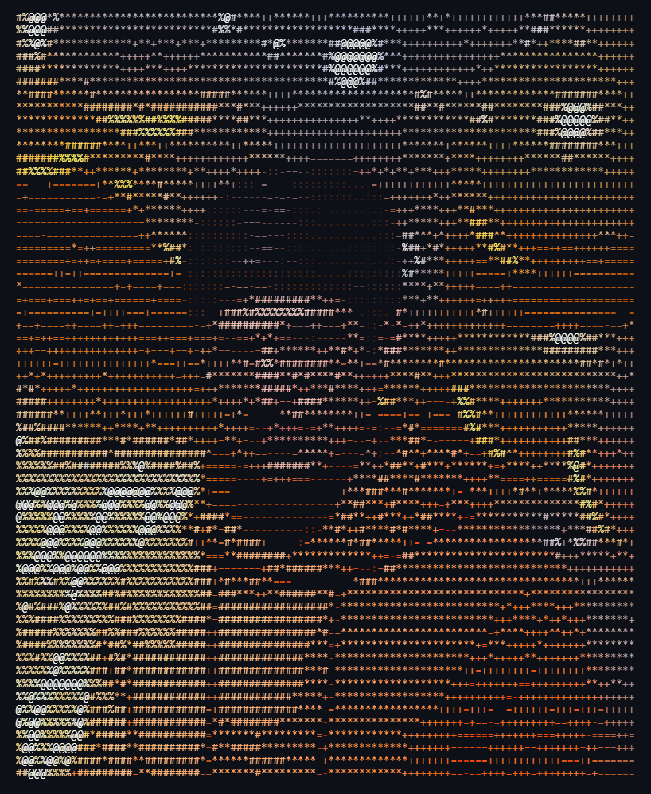
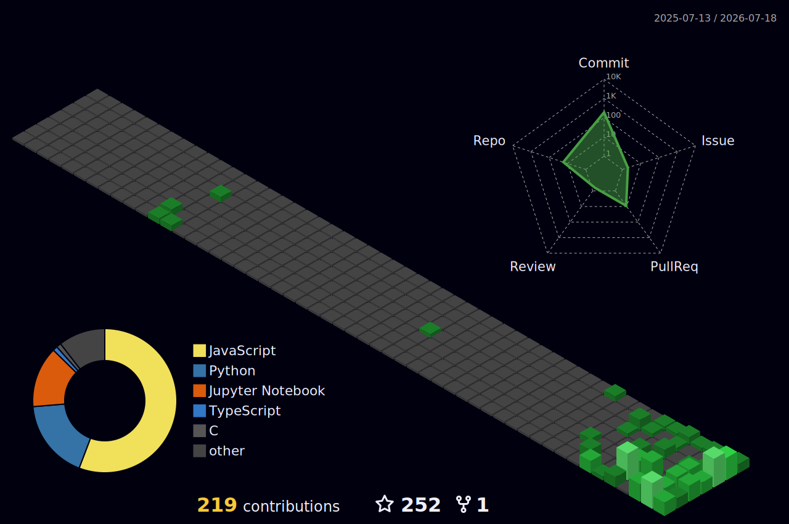

  

  

---

## 🎨 My Art Img

  

---

### 🚀 About Me

I'm a passionate **Python Developer** specializing in **Python-based web development** and data-driven applications. I enjoy transforming ideas into clean, functional code while continuously learning modern software development practices.

Currently, I am a **Dev Weekends Fellow '26** collaborating with local tech communities, and I am actively **seeking internship opportunities** where I can contribute to real-world projects and grow as a developer.

Alongside coding, I am a **passionate self-learner** currently mastering **React.js & Next.js** while practicing **DSA on LeetCode** to strengthen my programming fundamentals.

---

## 🚀 About Me

- 💻 Software Engineer specializing in Python and Full-Stack Web Development
- 🐍 Primary Languages: Python & C
- 🎨 UI/UX Design enthusiast using Figma to build templates and prototypes
- 🎓 Computer Science student focusing on modern software and python development
- 🤝 Dev Weekends Fellow '26 collaborating with local tech communities
- 📚 Passionate self-learner constantly exploring new tech
- ⚙️ Skilled in setting up Linux development environments and Git workflows
- 🌐 Seeking paid internships

---

# 💻 Tech Stack

### 🛠️ Languages & Frameworks

  

### 📊 Data Science Libraries

  &nbsp;&nbsp;
  &nbsp;&nbsp;
  &nbsp;&nbsp;
  

### ⚙️ Tools, DevOps & Platforms

  

## Programming Languages

  

- Python
- C

---

## Python Libraries

  &nbsp;&nbsp;
  &nbsp;&nbsp;
  &nbsp;&nbsp;
  

- Numpy
- Pandas
- Sk-learn
- Matplotlib

---

## Frontend

  

- Next.js
- React.js
- Vite + React
- JavaScript
- HTML5
- CSS3
- Tailwind
- BootStrap

---

## Backend

  

- C
- Python with Django

---

## Databases

- Json (API)

---

## DevOps & CI/CD

  

- Git
- GitHub

---

## Tools & Collaboration

  

- Replit
- Figma
- Discord
- VS Code
- Notion
- Vercel
- Anaconda (Miniconda)
- Raspberrypi

---

---

# 📁 Projects

### 🛒 Tour Travel Website
- **Tech Stack:** React.js (Vite)
- [Tour App](https://tour-travel-app-ruby.vercel.app)
- A modern, responsive frontend application for booking and exploring travel packages.

### 📚 Student Management System
- **Tech Stack:** C Language
- A CLI-based robust database management system built to handle student records efficiently.

---

# 📈 Current Focus

- 🎯 Software & Python Development
- 🤖 AI/ML Applications (Python)
- 🌐 Full Stack Architecture (Next.js)
- 🧠 Data Structures & Algorithms (LeetCode)

---

# 🐍 Contribution Snake

  <picture>
    <source media="(prefers-color-scheme: dark)" srcset="https://raw.githubusercontent.com/MehmoodCoder/MehmoodCoder/output/github-snake-dark.svg" />
    <source media="(prefers-color-scheme: light)" srcset="https://raw.githubusercontent.com/MehmoodCoder/MehmoodCoder/output/github-snake.svg" />
    
  </picture>

---

# 📊 GitHub Analytics

  
  

  

  

  

### 📈 3D Contribution Graph

  

### 📈 Deep GitHub Insights

  
  

  
  

---

# 📫 Connect With Me

  
  

  📧 <b>Email:</b> <a href="mailto:mehmood.mh56@gmail.com"><b>mehmood.mh56@gmail.com</b></a> 
  💼 <b>LinkedIn:</b> <a href="https://www.linkedin.com/in/mehmood-hassan-7604a03b1" target="_blank">linkedin.com/in/mehmood-hassan</a> 
  🐦 <b>X (Twitter):</b> <a href="https://x.com/MehmoodHassan56" target="_blank">x.com/MehmoodHassan56</a> 
  🐙 <b>GitHub:</b> <a href="https://github.com/MehmoodCoder" target="_blank">github.com/MehmoodCoder</a> 
  📸 <b>Instagram:</b> <a href="https://www.instagram.com/mehmood_mh56" target="_blank">instagram.com/mehmood_mh56</a> 
  👾 <b>Discord:</b> <a href="https://discord.com/users/1512160906715336874" target="_blank">discord.com/users/mehmood</a> 
  🟦 <b>Facebook:</b> <a href="https://www.facebook.com/share/1EabhnRp6p/" target="_blank">facebook.com/mehmood</a> 
  💻 <b>Portfolio:</b> <a href="https://mh56-portfolio.vercel.app" target="_blank">mh56-portfolio.vercel.app</a>

---

  ⭐ <i>"🤷‍♂️ Happy Coding Without Chai ☕"</i>

