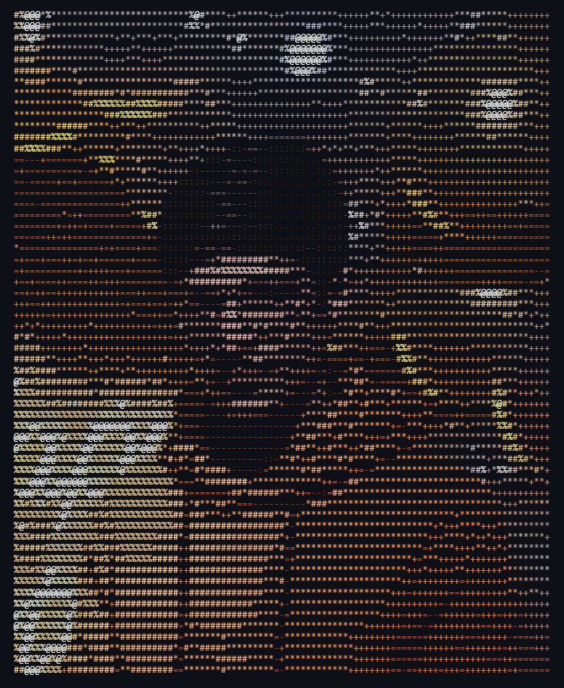
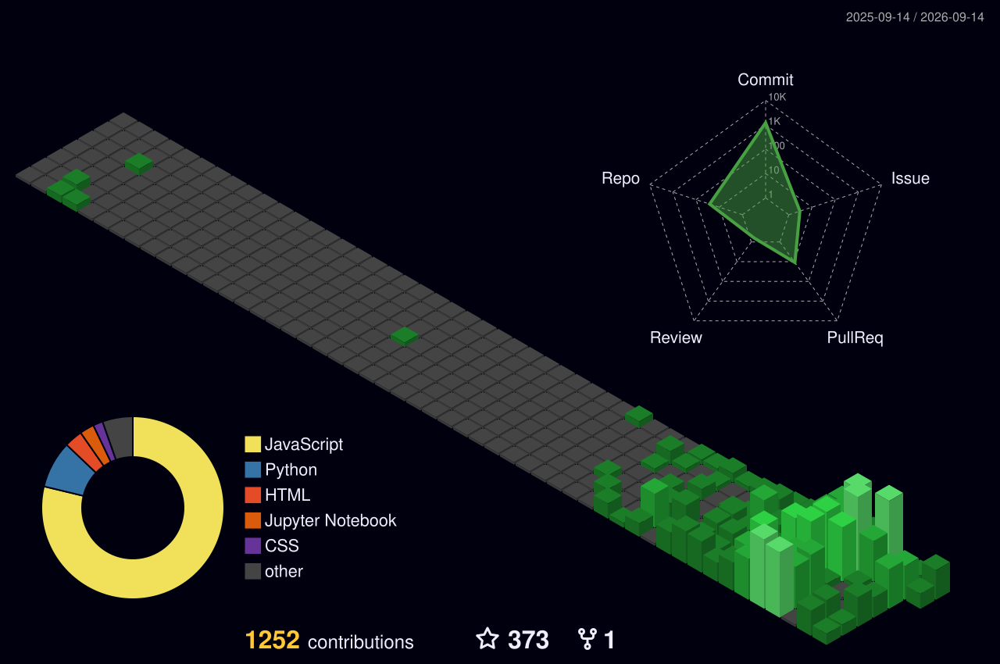

  

  

---

## 🎨 My Art Img

  

---

### 🚀 About Me

I'm a passionate **Python Developer** specializing in **Python-based web development** and data-driven applications. I enjoy transforming ideas into clean, functional code while continuously learning modern software development practices.

Currently, I am a **Dev Weekends Fellow '26** collaborating with local tech communities, and I am actively **seeking internship and collaborations opportunities** where I can contribute to real-world projects and grow as a developer.

Alongside coding, I am a **passionate self-learner** currently mastering **MERN Stack Development** while practicing **DSA on LeetCode** to strengthen my programming fundamentals.

---

## 🚀 About Me

- 💻 Software Engineer specializing in Python & Full-Stack Web Development (React, Next.js, Node.js)
- 🐍 Primary Focus: Python, Data Structures & Algorithms (LeetCode), and Web Architectures
- 🎨 UI/UX Design enthusiast using Figma for wireframing, components, and prototypes
- 🎓 Computer Science student focusing on modern software engineering and Python development
- 🤝 Dev Weekends Fellow '26 collaborating with local tech communities
- 📚 Passionate self-learner constantly exploring modern tech stacks and tools
- ⚙️ Skilled in setting up Linux dev environments, GitHub workflows, and full-stack tools
- 🌐 Open for paid internships, freelance projects, and tech collaborations

---

<h2 align="left">💻 Tech Stack &nbsp;&nbsp;</h2>

<table width="100%" style="border-collapse: collapse; border: 1px solid #30363d; background-color: #0d1117;">
  <thead>
    <tr style="border-bottom: 2px solid #30363d; background-color: #161b22; color: #f0f6fc;">
      <th align="left" style="padding: 12px; width: 22%;">Category</th>
      <th align="left" style="padding: 12px; width: 48%;">Interactive Badges / Icons</th>
      <th align="left" style="padding: 12px; width: 30%;">Technologies</th>
    </tr>
  </thead>
  <tbody style="color: #c9d1d9; background-color: #0d1117;">
    <!-- Languages -->
    <tr style="border-bottom: 1px solid #21262d; background-color: #0d1117;">
      <td style="padding: 12px;"><b>Languages</b></td>
      <td style="padding: 12px; vertical-align: middle;">
        &nbsp;&nbsp;
        &nbsp;&nbsp;
        &nbsp;&nbsp;
        
      </td>
      <td style="padding: 12px;">Python, C, JavaScript (ES6+), HTML5, CSS3</td>
    </tr>
    <!-- Frontend -->
    <tr style="border-bottom: 1px solid #21262d; background-color: #0d1117;">
      <td style="padding: 12px;"><b>Frontend Frameworks</b></td>
      <td style="padding: 12px; vertical-align: middle;">
        &nbsp;&nbsp;
        &nbsp;&nbsp;
        
      </td>
      <td style="padding: 12px;">Next.js, React.js, Vite, Tailwind CSS, Bootstrap</td>
    </tr>
    <!-- Backend -->
    <tr style="border-bottom: 1px solid #21262d; background-color: #0d1117;">
      <td style="padding: 12px;"><b>Backend & Web Frameworks</b></td>
      <td style="padding: 12px; vertical-align: middle;">
        
      </td>
      <td style="padding: 12px;">Node.js Core, Express.js, Django, REST APIs</td>
    </tr>
    <!-- Databases -->
    <tr style="border-bottom: 1px solid #21262d; background-color: #0d1117;">
      <td style="padding: 12px;"><b>Databases & Data Formats</b></td>
      <td style="padding: 12px; vertical-align: middle;">
        &nbsp;&nbsp;
        
      </td>
      <td style="padding: 12px;">MongoDB, JSON Data Structures, RESTful Services</td>
    </tr>
    <!-- Data Science & AI -->
    <tr style="border-bottom: 1px solid #21262d; background-color: #0d1117;">
      <td style="padding: 12px;"><b>Data Science & AI/ML</b></td>
      <td style="padding: 12px; vertical-align: middle;">
        &nbsp;&nbsp;
        &nbsp;&nbsp;
        &nbsp;&nbsp;
        &nbsp;&nbsp;
        
      </td>
      <td style="padding: 12px;">NumPy, Pandas, Scikit-learn, Matplotlib, Jupyter Notebooks</td>
    </tr>
    <!-- IDEs & Environments -->
    <tr style="border-bottom: 1px solid #21262d; background-color: #0d1117;">
      <td style="padding: 12px;"><b>IDEs & Environments</b></td>
      <td style="padding: 12px; vertical-align: middle;">
        &nbsp;&nbsp;
        
      </td>
      <td style="padding: 12px;">VS Code, Google Colab, Anaconda, Replit</td>
    </tr>
    <!-- Work & Practice Platforms -->
    <tr style="border-bottom: 1px solid #21262d; background-color: #0d1117;">
      <td style="padding: 12px;"><b>Work & Practice Platforms</b></td>
      <td style="padding: 12px; vertical-align: middle;">
        &nbsp;&nbsp;
        &nbsp;&nbsp;
        &nbsp;&nbsp;
        
      </td>
      <td style="padding: 12px;">Pathment (Tasks/Work), LeetCode, GitHub, Discord, Notion, Raspberry Pi</td>
    </tr>
    <!-- DevOps & Package Managers -->
    <tr style="border-bottom: 1px solid #21262d; background-color: #0d1117;">
      <td style="padding: 12px;"><b>DevOps & Workflow</b></td>
      <td style="padding: 12px; vertical-align: middle;">
        
      </td>
      <td style="padding: 12px;">NPM (Node Package Manager), Git, Vercel Deployment</td>
    </tr>
    <!-- Design & API Testing -->
    <tr style="background-color: #0d1117;">
      <td style="padding: 12px;"><b>Design & Testing Tools</b></td>
      <td style="padding: 12px; vertical-align: middle;">
        
      </td>
      <td style="padding: 12px;">Figma (UI/UX Prototyping), Postman (API Testing)</td>
    </tr>
  </tbody>
</table>

---

# 📁 Projects

### 🛒 Tour Travel Website
- **Tech Stack:** React.js (Vite)
- [Tour App](https://tour-travel-app-ruby.vercel.app)
- A modern, responsive frontend application for booking and exploring travel packages.

### 📚 Student Management System
- **Tech Stack:** C Language
- A CLI-based robust database management system built to handle student records efficiently.

---

# 📈 Current Focus

- 🎯 Software & Python Development
- 🤖 AI/ML Applications (Python)
- 🌐 Full Stack Architecture (Next.js, React.js & Node.js)
- 🧠 Data Structures & Algorithms (LeetCode)

---

# 📈 LeetCode Analytics

  
    &ensp;&ensp;
  

---

# 🐍 Contribution Snake

  <picture>
    <source media="(prefers-color-scheme: dark)" srcset="https://raw.githubusercontent.com/MehmoodCoder/MehmoodCoder/output/github-snake-dark.svg" />
    <source media="(prefers-color-scheme: light)" srcset="https://raw.githubusercontent.com/MehmoodCoder/MehmoodCoder/output/github-snake.svg" />
    
  </picture>

---

# 📊 GitHub Analytics

  
  

---

---

  

---

# 📈 3D Contribution Graph

  

---

# 📈 Deep GitHub Insights

  
  

  
  

---

# 📫 Connect With Me

  
  

  📧 <b>Email:</b> <a href="mailto:mehmood.mh56@gmail.com"><b>mehmood.mh56@gmail.com</b></a> 
  💼 <b>LinkedIn:</b> <a href="https://www.linkedin.com/in/mehmood-hassan-7604a03b1" target="_blank">linkedin.com/in/mehmood-hassan</a> 
  🐦 <b>X (Twitter):</b> <a href="https://x.com/MehmoodHassan56" target="_blank">x.com/MehmoodHassan56</a> 
  🐙 <b>GitHub:</b> <a href="https://github.com/MehmoodCoder" target="_blank">github.com/MehmoodCoder</a> 
  📸 <b>Instagram:</b> <a href="https://www.instagram.com/mehmood_mh56" target="_blank">instagram.com/mehmood_mh56</a> 
  👾 <b>Discord:</b> <a href="https://discord.com/users/1512160906715336874" target="_blank">discord.com/users/mehmood</a> 
  🟦 <b>Facebook:</b> <a href="https://www.facebook.com/share/1EabhnRp6p/" target="_blank">facebook.com/mehmood</a> 
  💻 <b>Portfolio:</b> <a href="https://mh56-portfolio.vercel.app" target="_blank">mh56-portfolio.vercel.app</a>

---

  ⭐ <i>"🤷‍♂️ Happy Coding Without Chai ☕"</i>

